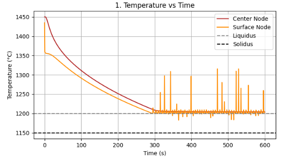
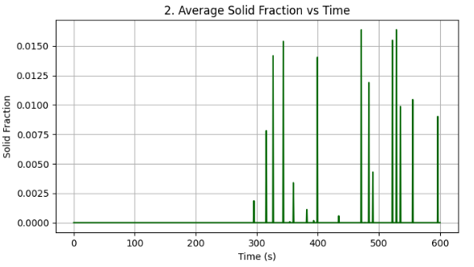
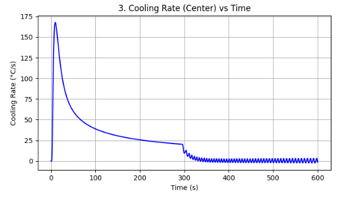
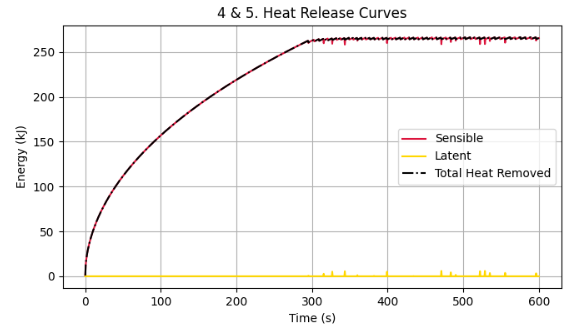
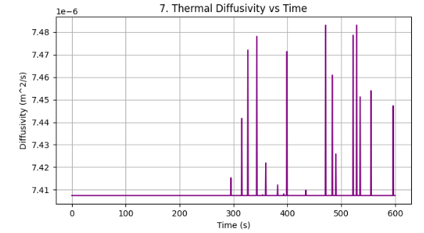
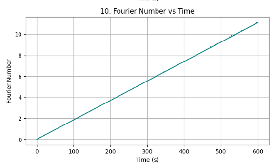
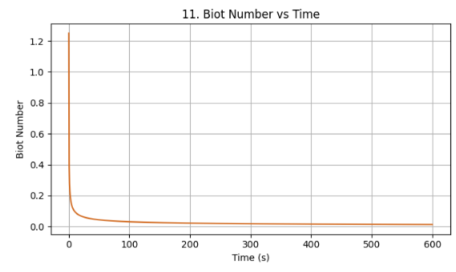
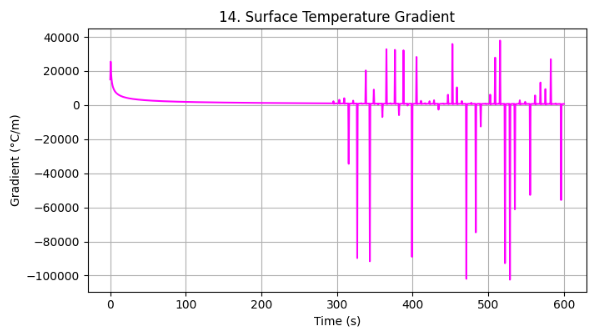

# Thermal-Modelling-Gray-Cast-Iron-Python
A Python-based 1D transient finite difference model for simulating the solidification behavior, heat transfer, and energy analysis of gray cast iron under realistic casting conditions.

# Thermal Modelling and Energy Analysis of Solidification in Gray Cast Iron Using Python


---

## Project Overview

Solidification plays a fundamental role in determining the microstructure, thermal history, and final quality of metallic castings. Understanding the heat transfer and phase transformation mechanisms during cooling is essential for optimizing casting processes and improving material performance.

This project presents a **one-dimensional transient thermal model** developed in **Python** using the **Finite Difference Method (FDM)** to simulate the cooling and solidification behavior of **gray cast iron** in a sand mold.

The simulation predicts temperature evolution, solid fraction development, cooling characteristics, thermal energy transfer, and solidification kinetics under realistic casting conditions.

The project demonstrates how computational methods can be applied to solve practical metallurgical problems using open-source scientific computing tools.

---

# Primary Objective

To develop a **1D transient thermal model** in Python using the **Finite Difference Method (FDM)** for simulating the solidification behavior of gray cast iron and analyzing its thermal and energy characteristics during cooling.

---

# Key Features

- 1D Transient Heat Conduction Model
- Finite Difference Method (Explicit Scheme)
- Gray Cast Iron Solidification Simulation
- Sand Mold Heat Transfer Model
- Thermal Energy Analysis
- Phase Transformation Modelling
- Numerical Stability Verification
- Engineering-Based Material Properties
- Publication-Quality Visualizations

---

# Simulation Outputs

The numerical model evaluates the following engineering parameters:

- Temperature vs Time
- Solid Fraction vs Time
- Cooling Rate vs Time
- Sensible Heat Curve
- Latent Heat Release Curve
- Total Thermal Heat Removed
- Mass of Casting
- Thermal Diffusivity
- Fourier Number
- Biot Number
- Solidification Time
- Maximum Cooling Rate
- Temperature Gradient
- Solidification Front Velocity
- Energy Balance Validation

---

# Numerical Methodology

The computational model is based on the following physical principles:

- One-Dimensional Transient Heat Conduction
- Fourier's Law of Heat Transfer
- Finite Difference Method (FDM)
- Conservation of Energy
- Phase Change Modeling
- Solid Fraction Evolution
- Heat Balance Analysis

The governing transient heat equation is solved iteratively over discretized spatial and temporal domains to simulate the complete solidification process.

---

# Material Properties

### Gray Cast Iron

| Property | Value |
|-----------|------:|
| Density | 7200 kg/m³ |
| Thermal Conductivity (Liquid) | 40 W/m·K |
| Thermal Conductivity (Solid) | 52 W/m·K |
| Specific Heat (Liquid) | 750 J/kg·K |
| Specific Heat (Solid) | 550 J/kg·K |
| Latent Heat of Fusion | 250,000 J/kg |

---

# Technologies Used

- Python
- NumPy
- Matplotlib
- Google Colab
- Jupyter Notebook

---

# Repository Structure

```text
thermal-modelling-gray-cast-iron-python/

│── README.md
│── Thermal_Modelling_Gray_Cast_Iron.ipynb

│── images/
│     ├── temperature_vs_time.png
│     ├── solid_fraction_vs_time.png
│     ├── cooling_rate_vs_time.png
│     ├── sensible_heat_curve.png
│     ├── thermal_diffusivity_vs_time.png
│     ├── fourier_number.png
│     ├── surface_temperature_gradient.png

└── LICENSE
```

---

# Key Numerical Results

| Parameter | Result |
|------------|--------|
| Mass of Casting | 1.44 kg |
| Thermal Diffusivity | 7.41 × 10⁻⁶ m²/s |
| Total Solidification Time | 600 s |
| Maximum Cooling Rate | 167.82 °C/s |
| Total Heat Removed | 265.59 kJ |
| Mean Biot Number | 0.0254 |

---

# Simulation Results

### Temperature Distribution



---

### Solid Fraction Evolution



---

### Cooling Rate



---

### Sensible Heat



---

### Thermal Diffusivity



---

### Fourier Number



---

### Biot Number



---

### Surface Temperature Gradient



---

# Engineering Significance

This project demonstrates the application of computational heat transfer and numerical methods to simulate industrial solidification processes.

The developed model can assist in:

- Understanding casting thermal behavior
- Predicting solidification characteristics
- Estimating energy transfer during cooling
- Supporting computational metallurgy education
- Providing a foundation for advanced casting simulations

---

# Future Scope

Possible extensions of this work include:

- Temperature-dependent material properties
- 2D and 3D thermal modelling
- Enthalpy-based phase change formulation
- Microstructure evolution prediction
- Thermal stress and shrinkage analysis
- Machine Learning-assisted casting optimization
- Experimental validation using thermocouple data

---

# References

- Chalmers, *Principles of Solidification*
- Flemings, *Solidification Processing*
- ASM Handbook, Volume 15: Casting
- Stefanescu, *Science and Engineering of Casting Solidification*
- Incropera et al., *Fundamentals of Heat and Mass Transfer*

---

# Author

**Dhrubajyoti Bhattacharjee**

Mechanical Engineer | Computational Metallurgy Enthusiast

Independent Researcher

---

# License

This project is released under the **MIT License**.

---

## If you found this project useful, please consider giving it a ⭐ on GitHub.
